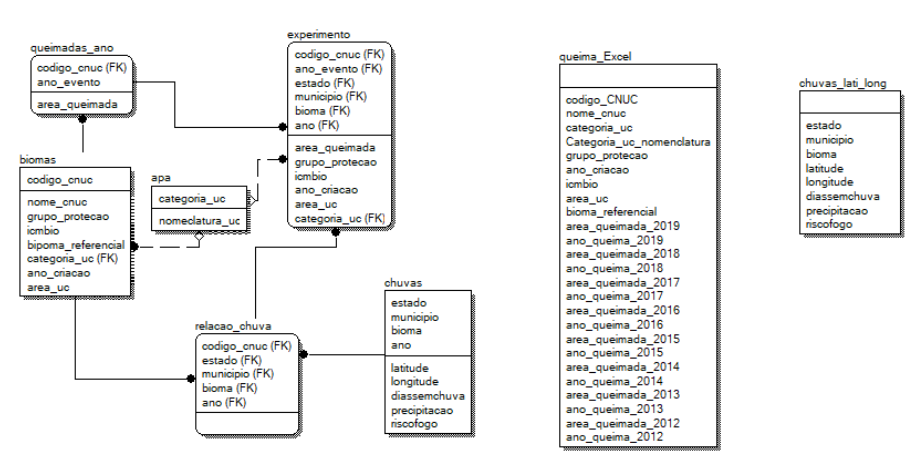

||**TERMO DE ABERTURA DO PROJETO** |
| :- | :-: |
||**NOME DO PROJETO: Determinação da natureza das queimadas, se provocada pelo homem, se ocorreu naturalmente e predição de queimadas futuras no Brasil**|
||**CÓDIGO DO PROJETO: 001**|

|**Histórico de Revisão**|
| :- |

Versão | Data | Descrição da Revisão | Autores
------------ | ------------- | ------------- | -------------
V2 | 18/03/2021 | Segunda versão do projeto | Mauro Bastos Ronilson Pinho e Charles Pimentel

|**1 – Nome do Projeto**|**2.1 – Código do Projeto**|
| :- | :- |
|**Determinação da natureza das queimadas, se provocada pelo homem, se ocorreu naturalmente e predição de queimadas futuras no Brasil**|*PROJ\_QUEIMA\_BR*|

|**2 – Nome dos Gerentes do Projeto**|
| :- |
|*Mauro Penha Bastos, Ronilson Pinho e Charles Pimentel*|

|**3 – Alinhamento estratégico - Abstract**|
| :- |
|
*Resolver a dificuldade de entender o quanto as queimadas no Brasil são causadas pelo homem e quanto são naturais.*

*Determinar a probabilidade de queimadas para os próximos cinco anos nos diversos biomas estudados.*

*Nesse contexto o método criará parâmetros acompanhados de probabilidades, que permitirá que todas as partes interessadas nacionais e internacionais possam aferir se as queimadas que ocorrem no Brasil foram causadas pelo homem e quais foram causadas pela natureza, acompanhada de uma probabilidade, que informa o grau de certeza.. O método irá evitar a escalada de incêndios, através da responsabilização dos órgãos governamentais da área, caso o sistema aponte para ações antinaturais, além de melhorar a saúde da população, ao evitar incêndios.*

*Sabemos que as queimadas causam inúmeros danos ao solo, principalmente na questão nutricional. Ele altera, direta ou indiretamente, as características físicas, químicas, morfológicas e biológicas. Sabendo disso e obtendo três dataset sobre queimadas da base do INPE entre  2015 e 2019. Pretendemos desenvolver um trabalho baseado em IA (inteligência Artificial) que possa predizer se as ações de queimadas nessa região é provocada por ação natural ou não.*
 
*A missão do método é estabelecer uma base para que as queimadas possam ser aferidas e previstas por qualquer que seja o governo ou, grupo interessado possa verificar os eventos e trazer credibilidade para os governos no Brasil.*
 
*Hoje temos uma lacuna na fiscalização da procedência das queimadas, e pretendemos solucionar o problema com a medição de queimadas e predizendo as futuras queimadas naturais. Desse modo nosso método cria uma base que prioriza o meio ambiente e permite que qualquer pessoa afira de forma clara se uma queimada foi natural ou não e que os governos possam se preparar para as futuras queimadas previstas.*

  
|**4 – Objetivos do projeto** |
| :- |
|
*Resolver a dificuldade de entender o quanto as queimadas no Brasil são causadas pelo homem e quanto são naturais, e determinar a probabilidade de queimadas para os próximos cinco anos nos diversos biomas estudados.*

- *Predizer em forma de probabilidade, quando vai haver queimada baseado nos eventos passados;*

- *Determinar através de um método supervisionado os fatores que mais contribuem para as queimadas, acompanhados de suas respectivas probabilidades, usando árvore de classificação;*

- *Determinar através de um método supervisionado se as queimadas, são naturais ou não acompanhados de suas respectivas probabilidades, usando árvore de classificação;*

- *Determinar através de um método não supervisionado se o padrão de queimada é natural ou não (Redes Neurais);*

- *Prover para o Brasil um método de predição de queimadas pera os próximos cincos anos usando árvore de regressão.*

- *Reduzir queimadas, trazer credibilidade para o Brasil sobre a gestão do meio ambiente.*
|

|**5 – Modelo de Dados do Experimento**|
|| 

|**6 – Descrição do DataSet e suas fontes**|
| :- |
|
*Recuperamos a base de queimadas e chuvas de 5 anos no Brasil e os Datasets tem as seguintes características.*

**1)	Dados brutos (RAW): Dataset dos incêndios nos Biomas do Brasil:**

a) *TXT baixado no dia 7/03/2021 às 14:03, do site www.inpe.gov.br contendo informações de todos os incêndios do Brasil dos anos de 2012 e 2019, chamado “incendios_em_unidades_de_conservacao_federal.csv”.*

b) *Dados transferidos sem modificação via Python3 rodando em Windows 10 Professional para a tabela “queima_Excel” em banco PostgreSql versão 9.5.*

**2) Dados brutos (RAW): Dataset de chuvas com atributos a serem transformados para que os dados de queimadas, seja enriquecido:**

a) *TXT baixado no dia 15/03/2021 às 18:42, do site www.inmet.gov.br contendo informações de chuvas em todos os biomas do Brasil dos anos de 2010 e 2011, chamado “Vs_2_1_Focos_2010-01-01_2011-01-01.csv”, contendo 1.048.576 registros.*

b) *Carregado em um Dataframe via Python3 rodando em Windows 10 Professional, e retirada as colunas x, y e agrupado por estado, município, e bioma gerando a tabela “chuvas” no banco de dados PostgreSql versão 9.5 reduzidos a 5,578 registros.*

c) *Na carga da base chuvas, foram achadas a latitude e longitude.*

**Decomposição das bases de queimadas e chuvas em tabelas:**

1- *Dados de Informação do Bioma.*

2- *Dados de eventos de queimadas.*

3- *Chuvas.*

**Limpeza dos dados:**

1- *Foi detectada entre os 1.045.575 linhas de chuva, uma linha com o campo bioma em branco e pode ser atualizado para “Pampas”, através do estado e município.*

2- *Os dados anuais de eventos não ocorridos, foram zerados de modo a contar como quantidade, mas não contar como valor no algoritmo de predição.*

*3-	Como o objetivo na tabela de chuvas é localizar (latitude e longitude) o bioma, e existiam milhares de valores diferentes para um único bioma, os mesmos foram substituídos pelas médias das latitudes e as médias das longitudes.*
|

|**7 – Experimento**|
| :- |
|
**1) Estágio atual do projeto:**

*a. Definimos o experimento.*

*b. Obtivemos os datasets de entrada .*

*c. Definimos todas as tabelas.*

*d. Carregamos RAW.*

*e. Fizemos as extrações, as transformações, e as carga  das informações necessárias.*

**2) Foram criadas 4 tabelas de trabalho, conforme modelo de dados.**

**3) As informações de proveniência foram colocadas em script Python3 no Github, conforme descrito no item 6.**

**4) Iremos gerar a tabela “experimento” a partir das demais tabelas para início dos experimentos de classificação de eventos “Naturais” ou “Provocados Pelo Homem” dependendo do resultado de cada uma das queimadas.**

**5) Na próxima semana iremos programar o experimento e preparar o experimento de predição de novas queimadas com o mesmo Dataset “experimento”.**
|

|**8 – EAP do Projeto**|
| :- |
|
*WBS do Projeto ( EAP – Estrutura Analítica do Projeto)*

*A EAP vai ser finalizada na semana de 25/03/2021*
|

|**9 – Estimativa de Usuários**|
| :- |
|
*58 milhões de pessoas afetadas pelas queimadas diretamente nos diversos estados do Brasil*

*Fonte: IBGE mar/2021  - xxxxxxxx*
|

|**10 – Prazo do Projeto**|
| :- |
|*240  horas de trabalho – 60 horas / semana = 4 semanas*|

|**11 – Equipe de Gestão do Projeto**|
| :- |

Função no Projeto | Nome | Lotação | Telefone | E-mail
------------ | ------------- | ------------- | ------------- | -------------
Orientadores | Sérgio Serra e Jorge Zavaleta | UFRJ - NCE | 21 | E-mail
Doutorandos | Mauro, Ronilson e Charles | UFRJ - NCE | 21 | auropbastos@gmail.com, ronilsonpinho@gmail.com, pimentelufrj@gmail.com

|**12 – Scripts do Projeto**|
| :- |
|*Arquivos_V.2*|

|**13 – Scripts Python**|
| :- |
|*Arquivos_V.2*|

|**14 – Modelo de Script postgreSql para captura de TXT**|
| :- |
|*Arquivos_V.2*|

|**15 – Restrições**|
| :- |
|
*1.A conclusão do projeto ocorrerá na segunda semana de 04/2021.*

*2.As detecções de queimadas futuras terão um resultado probabilístico e devemos entender nos próximos dias se os dados atuais conseguem gerar essa previsão.*

*3.Deverá haver um protótipo funcional e rodando antes da apresentação final do projeto.*
|

|**16 – Documentos de Referência**|
| :- |
|
Lei nº xxxxxxx dos Institutos Federais de 29 de dezembro de 2008.http://www.imp.gov.br

Instrução Normativa nº 04 de 12 de novembro de 2010.

http://www.governoeletronico.gov.br/sisp-conteudo/nucleo-de-contratacoes-de-ti/modelo-de-contratacoes-normativos-e-documentos-de-referencia/instrucao-normativa-mp-slti-no04/*
|

*
*
*
*
*
||**TERMO DE ABERTURA DO PROJETO** |
| :- | :-: |
||**NOME DO PROJETO: Determinação da natureza das queimadas, se provocada pelo homem, se ocorreu naturalmente e predição de queimadas futuras no Brasil**|
||**CÓDIGO DO PROJETO: 001**|

|**Histórico de Revisão**|
| :- |

Versão | Data | Descrição da Revisão | Autores
------------ | ------------- | ------------- | -------------
V1 | 11/03/2021 | Primeira versão do projeto | Mauro Bastos Ronilson Pinho e Charles Pimentel

|**1 – Nome do Projeto**|**2 – Código do Projeto**|
| :- | :- |
|**Determinação da natureza das queimadas, se provocada pelo homem, se ocorreu naturalmente e predição de queimadas futuras no Brasil**|*PROJ\_QUEIMA\_BR*|

|**3 – Nome dos Gerentes do Projeto**|
| :- |
|*Mauro Penha Bastos, Ronilson Pinho e Charles Pimentel*|

|**4 – Alinhamento estratégico - Abstract**|
| :- |
|
*Resolver a dificuldade de entender o quanto as queimadas no Brasil são causadas pelo homem e quanto são naturais.* 

*Determinar a probabilidade de queimadas para os próximos cinco anos nos diversos biomas estudados.* 

*Nesse contexto o método criará parâmetros acompanhados de probabilidades, que permitirá que todas as partes interessadas, nacionais e internacionais, possam aferir se as queimadas que ocorrem no Brasil foram causadas pelo homem e quais foram causadas pela natureza, acompanhada de uma probabilidade, que informa o grau de certeza. O método irá evitar a escalada de incêndios, através da responsabilização dos órgãos governamentais da área, caso o sistema aponte para ações antinaturais, além de melhorar a saúde da população, ao evitar incêndios.*

*Sabemos que as queimadas causam inúmeros danos ao solo, principalmente na questão nutricional. Ele altera, direta ou indiretamente, as características físicas, químicas, morfológicas e biológicas. Sabendo disso e obtendo três dataset sobre queimadas da base do INPE entre  2015 e 2019, pretendemos desenvolver um trabalho baseado em IA (inteligência Artificial) que possa predizer se as ações de queimadas nessa região é provocada por ação natural ou não*. 

*A missão do método é estabelecer uma base para que as queimadas possam ser aferidas e previstas por qualquer que seja o governo, ou grupo interessado, que deseje verificar os eventos e trazer credibilidade para os governos no Brasil.* 

*Hoje temos uma lacuna na fiscalização da procedência das queimadas, e pretendemos solucionar o problema com a medição de queimadas e predizendo as futuras queimadas naturais. Desse modo nosso método cria uma base que prioriza o meio ambiente e permite que qualquer pessoa afira de forma clara se uma queimada foi natural ou não e que os governos possam se preparar para as futuras queimadas previstas.*
|

|**5 – Objetivos do projeto** |
| :- |
|
*Resolver a dificuldade de entender o quanto as queimadas no Brasil são causadas pelo homem e quanto são naturais, e determinar a probabilidade de queimadas para os próximos cinco anos nos diversos biomas estudados.* 

- *Predizer em forma de probabilidade, quando vai haver queimada baseado nos eventos passados;*

- *Determinar através de um método supervisionado os fatores que mais contribuem para as queimadas, acompanhados de suas respectivas probabilidades, usando árvore de regressão.*

- *Determinar através de um método supervisionado se as queimadas, são naturais ou não acompanhados de suas respectivas probabilidades, usando árvore de classificação.*

- *Determinar através de um método não supervisionado se o padrão de queimada é natural ou não (Redes Neurais).*

- *Prover para o Brasil um método de predição de queimadas pera os próximos cincos anos usando árvore de regressão.*

- *Reduzir queimadas, trazer credibilidade para o Brasil sobre a gestão do meio ambiente.*
|

|**6 – Descrição do DataSet e suas fontes**|
| :- |
|
*Recuperamos a base de queimadas de 5 anos no Brasil e o dataset tem as seguintes características:* 

1) *Não foi possível nos concentramos no dataset do Pantanal*

2) *Estamos tendo dificuldades de encontrar um dataset de chuvas que possua um atributo que se ligue com as bases de queimadas* 

*Pretendemos decompor a base de queimadas em duas bases:* 

1) *Dados de Informação do Bioma*

2) *Dados de eventos de queimadas*

*Limpeza dos dados:*

1) *Os dados de eventos não ocorridos serão zerados de modo a contar como quantidade, mas não contar como valor*
|

|**7 – EAP do Projeto**|
| :- |
|
*WBS do Projeto ( EAP – Estrutura Analítica do Projeto)*

*A evoluir ........*

|

|**8 – Estimativa de Usuários**|
| :- |
|
*58 milhões de pessoas afetadas pelas queimadas diretamente nos diversos estados do Brasil*

*Fonte: IBGE mar/2021  - xxxxxxxx*
|

|**9 – Prazo do Projeto**|
| :- |
|*240  horas de trabalho – 60 horas / semana = 4 semanas*|

|**10 – Equipe de Gestão do Projeto**|
| :- |

Função no Projeto | Nome | Lotação | Telefone | E-mail
------------ | ------------- | ------------- | ------------- | -------------
Orientadores | Sérgio Serra e Jorge Zavaleta | UFRJ - NCE | 21 | E-mail
Doutorandos | Mauro, Ronilson e Charles | UFRJ - NCE | 21 | auropbastos@gmail.com, ronilsonpinho@gmail.com, pimentelufrj@gmail.com

|**11 – Restrições**|
| :- |
|
1. *A conclusão do projeto ocorrerá na segunda semana de 04/2021*

2. *Não será possível fazer a parte de detecção de queimada natural ou não, se não conseguirmos um dataset de chuvas com uma chave de conexão com o dataset de queimadas*

3. *Deverá haver um protótipo funcional e rodando antes da apresentação final do projeto*
|

|<h5>**12 – Documentos de Referência**</h5>|
| :- |
|
Lei nº xxxxxxx dos Institutos Federais de 29 de dezembro de 2008. http://www.imp.gov.br

Instrução Normativa nº 04 de 12 de novembro de 2010. http://www.governoeletronico.gov.br/sisp-conteudo/nucleo-de-contratacoes-de-ti/modelo-de-contratacoes-normativos-e-documentos-de-referencia/instrucao-normativa-mp-slti-no04/
|
